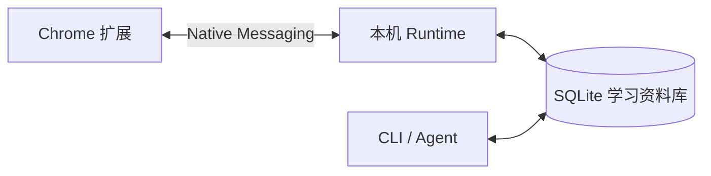

# Marginway · 语境

**从内容出发，让思考延续。**

Marginway 是一个在网页和 YouTube 视频旁使用的学习工具：理解一个词、记下一个想法，同时留下原文和位置，之后能回去复习，也能带着上下文与 Agent 继续讨论。

收藏了很多内容，却忘记“为什么收藏、当时看到哪里”？Marginway 把学习记录留在它产生的**语境**里，让词汇和笔记有据可循。

[开始使用](docs/installation.md) · [与 Agent 一起学习](skills/SKILL.md) · [开发与贡献](CONTRIBUTING.md)


*当前产品组件的实际渲染，使用演示文本与本地 fixture；不是概念设计，不含私人笔记或服务密钥。复现方式见[工程说明](docs/engineering.md#产品截图)。*

## 从一次遇见，到下一次理解

1. **阅读或看视频。** 在网页选词，或在视频下方、侧栏的双语字幕中停下来理解一句话。
2. **留下词汇和想法。** 语境卡片展示释义、原文与翻译；收藏选中的词，也可以记下自己的问题。
3. **回到同一份材料。** 资料库按资源组织词汇语境和笔记，可以分类、搜索、编辑；误删可从回收站恢复。学习统计是首页，热力图记录学习足迹。
4. **再看一遍，再想一步。** 单词复习带着原句；点击时间点或原文链接回溯。「在 Agent 中讨论」将当前上下文组成 Prompt，粘贴到你使用的 Agent 中继续多轮思考。


## 三个原则

**在语境中学习。** 不只留下一个孤立释义：词条关联出现时的句子、来源网址和视频时间。复习时可以回到当初产生疑问的位置。

**资料留在自己手里。** Local-first 指学习资料存于本机 SQLite，可以导出；没有开发者托管后端、账号系统或遥测。它不表示所有功能离线：字幕获取使用 Supadata，翻译使用 DeepSeek，由你配置自己的密钥并按供应商规则付费。

**把思考交给你自己的 Agent。** Agent-native 指浏览器与 CLI 访问同一本地资料库，而非内置一个替你决策的聊天机器人。Agent 可读取语境、查询记录、带身份写回结论；多轮讨论发生在你选择的 Agent 中。界面与 CLI 都保留原文关联和修订历史。

## 开始使用

当前为早期开发版，**桌面 Chrome + 本机运行组件**，尚未提供 Chrome Web Store 或免 Node 安装器。当前仓库访问需授权；源码采用 [MIT 许可](LICENSE)，可审阅、修改和自行构建。

[按步骤安装与配置 →](docs/installation.md)

可以把安装说明交给 Agent：让它检查环境、构建项目、安装到你明确选择的长期目录并验证；你完成 Chrome 的目录选择和密钥配置。当前仍需 Node.js 22.23.2、pnpm 11.22.0，不要求你理解内部桥接协议。

安装后，打开一个有原生字幕的 YouTube 视频或普通网页，划词保存第一条记录，再到资料库回看。手机 Chrome 暂不支持；macOS 已实测，Windows/Linux 的脚本已过 CI，真实浏览器安装仍需平台验证。

## 与 Agent 延续讨论

卡片中的「在 Agent 中讨论」会复制当前原文、来源和问题，供你粘贴到其他 Agent。若 Agent 可以操作本机，它还可以使用 [配套 Skill](skills/SKILL.md)：

```sh
learning capabilities
learning resources.list
```

读到当前 anchorId 后，用 `notes.append` 追加结论；修改和删除使用明确的记录 ID、修订号和请求 ID。写回标为 Agent，保留客户端及模型自报身份；不会冒充你亲自写的笔记。没有本机 CLI 的 Agent 仍可通过复制的 Prompt 讨论，但不能直接写回本机资料库。

## 数据如何流动



API Key 留在当前 Chrome profile 的扩展配置中，不写入学习数据库、Prompt 或备份。获取字幕时向 Supadata 发送视频网址，翻译时向 DeepSeek 发送所需原文语境；复制到其他 Agent 的内容由你决定是否粘贴。完整边界见 [隐私说明](PRIVACY.md)。

## 开发与信任

[源码构建与安装](docs/installation.md) · [工程结构与测试](docs/engineering.md) · [版本与发布](docs/releases.md) · [贡献流程](CONTRIBUTING.md)

[安全说明](SECURITY.md) · [第三方许可](THIRD_PARTY_NOTICES.md) · [许可证](LICENSE)

未来安装体验的[目标架构与机器接口](docs/runtime-installation-design.md)已单独记录，文中的设计命令不属于当前发行能力。
