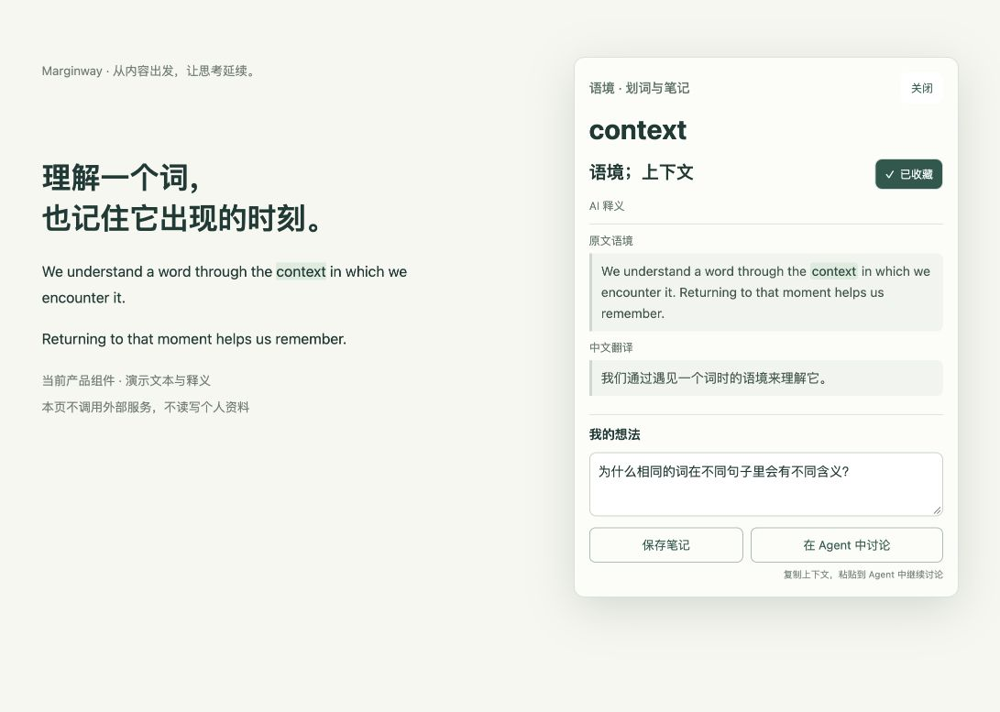
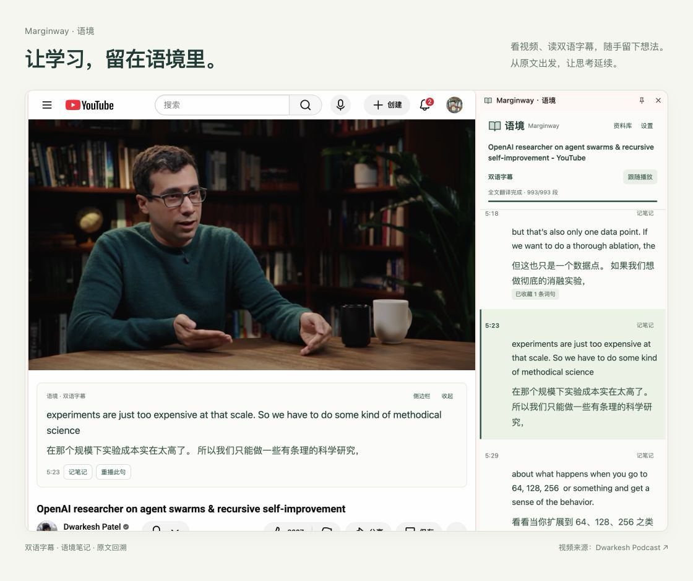
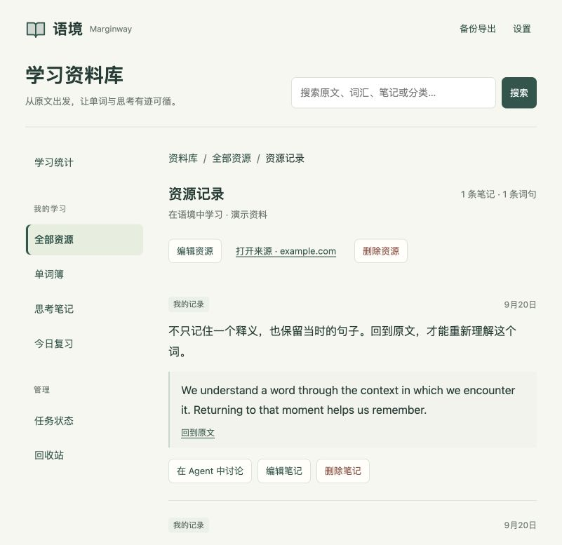

# Marginway · 语境

**从内容出发，让思考延续。**

在网页和 YouTube 视频旁理解一个词、记下一个想法，留下原文与位置，再带着上下文回顾或与 Agent 继续讨论。

[交给你的 Agent：安装、配置与学习](skills/SKILL.md)

## 在原文旁，留下理解

阅读网页，或观看带双语字幕的视频时，选中一个词，就能查看释义、收藏词汇、写下想法。句子和时间点一起保留，之后还找得到当时的语境。

## 看视频时，字幕就在视线旁

视频下方显示当前句的双语字幕，侧栏保留前后文并跟随播放。需要理解一个词或记下想法时，就从字幕开始；点击时间点回到原处，也可以重播当前句。

[静态展示页源码](docs/product/index.html) · [查看原始截图](docs/assets/product-video.png)。视频：[Dwarkesh Podcast · OpenAI researcher on agent swarms & recursive self-improvement](https://www.youtube.com/watch?v=6AgOfiZOWiY)。

## 回到材料，继续学习

同一份资源下的词汇和笔记聚在一起。用分类和搜索找到材料，回到原文或视频时间点；通过词汇复习和学习热力图回看自己的积累。

## 让你的 Agent，接着学下去

Marginway 为 Agent 提供统一的 Skill 入口。从安装配置，到读取语境、复习词汇、整理笔记，都可以交给能操作本机的 Agent。

- **从一个问题继续讨论**：点击「在 Agent 中讨论」，复制简短交接指令；Agent 按需读取原句、译文与笔记，不必一次粘贴全部资料。
- **把记录变成下一次学习**：让 Agent 找出待复习的词，带着原句练习，或按资源分类回顾自己的笔记。
- **让讨论回到原处**：你要求保存时，Agent 将结论写回关联笔记，保留原文位置并标注 Agent 来源。

例如：「带我复习到期的词，先别告诉我答案。」或「结合这句原文继续讨论，把结论存成笔记。」

需要本机访问权限与配套组件。纯聊天 Agent 可以根据节选讨论，但不能直接读取或写回本机资料库。

**阅读 / 看视频 → 划词与想法 → 保留语境 → 资料库 → 回顾原文 → 延续讨论**

语境卡片和资料库图使用合成演示资料，视频图为实际运行截图；[截图规范与复现](docs/engineering.md#产品截图)。

## 开始与了解

当前为桌面 Chrome 早期开发版，需从源码安装并配置自己的服务密钥；仓库访问需授权。学习资料存于本机，字幕与翻译会调用第三方服务。手机 Chrome 暂不支持。

**开始前需要准备两项服务配置：**

| 服务 | 用途 | 在哪里配置 |
| --- | --- | --- |
| Supadata | 获取 YouTube 原生字幕 | 在扩展设置中填写自己的 API Key |
| DeepSeek | 双语字幕翻译与划词释义 | 在扩展设置中填写自己的 API Key |

第三方服务有各自的额度与费用，使用前请确认账户可用额度。当前仅支持有原生字幕的视频。密钥由你在本机扩展设置中填写，不需要发给 Agent 或粘贴到聊天里。

Agent 会按 Skill 检查运行环境、引导安装本机组件与 Chrome 扩展，再帮助检查连接；你完成 Chrome 确认和密钥填写即可。具体步骤见[安装指南](docs/installation.md)。

把下面这段话交给能操作本机的 Agent：

> 请读取 https://github.com/xiaoji714/marginway-learning/blob/main/skills/SKILL.md ，按 Skill 帮我安装、配置并验证 Marginway；已有安装请沿用，需要我操作时逐步引导。

[Marginway Skill](skills/SKILL.md) · [手动安装指南](docs/installation.md) · [隐私与数据](PRIVACY.md)

[开发与贡献](CONTRIBUTING.md) · [工程架构与测试](docs/engineering.md) · [版本与发布](docs/releases.md) · [安装体验设计](docs/runtime-installation-design.md)

[安全说明](SECURITY.md) · [第三方许可](THIRD_PARTY_NOTICES.md) · [MIT 许可证](LICENSE)
