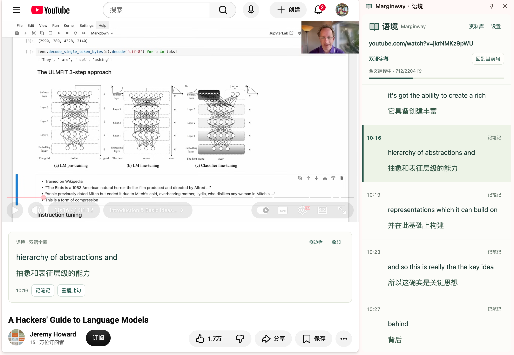

# Marginway · 语境

**从内容出发，让思考延续。**

读双语字幕，记下词汇与想法。保留语境，随时回到原处。

[官网演示](https://marginway.jijiujie.chatgpt.site) · [开始使用](#跟着-agent开始使用) · [使用指南](docs/usage.md)

## 看视频，字幕就在视线旁

当前句在视频下方，前后文在侧栏。划词、记笔记，点击时间点回到原处。

视频：Jeremy Howard · [A Hackers’ Guide to Language Models](https://www.youtube.com/watch?v=jkrNMKz9pWU)，CC BY。截图含机器翻译，不代表原作者背书；[来源说明](THIRD_PARTY_NOTICES.md)。

## 记住一个词，也记住它的语境

网页与字幕中选词，查看释义、收藏词汇、留下想法。原句和位置一起保存。

## 随时回看，接着理解

词汇、笔记按材料归集。带着原句复习，一键回到视频时间点。资料保存在本机，支持导出。

卡片与资料库使用合成演示资料；[截图规范](docs/engineering.md#产品截图)。

## 说出目标，让 Agent 操作 Marginway

提供 **Marginway Skill + CLI**，让 Agent 查询资料、发起翻译、整理词汇与笔记。你描述目标，它来组合产品功能。

- 「用 Marginway Skill 看看我这周学了什么，按主题整理。」
- 「用 Marginway Skill 比较这周和上周的学习频率。」
- 「用 Marginway Skill 整理 AI Agent 相关笔记，找出值得追问的问题。」

需能操作本机的 Agent 与配套组件。写入及付费操作按你的要求执行，内容标注 Agent 来源。[更多任务与统计口径](docs/usage.md#交给-agent)。

## 跟着 Agent，开始使用

### 01 / 安装

把下面的指令交给能操作本机的 Agent，按提示完成安装、检查与 Chrome 确认：

> 请读取 https://github.com/xiaoji714/marginway-learning/blob/main/skills/SKILL.md ，按 Skill 帮我安装、配置并验证 Marginway；已有安装请沿用，需要我操作时逐步引导。

桌面 Chrome 早期版；从 [Releases](https://github.com/xiaoji714/marginway-learning/releases/latest) 下载完整安装 ZIP，交给 Agent 按[安装指南](docs/installation.md)校验、解压和配置。仓库需授权，无商店入口，手机 Chrome 暂不支持。

### 02 / 配置

跟着 Agent 获取密钥，再填进扩展设置：

- [Supadata](https://dash.supadata.ai/)：获取 YouTube 原生字幕。
- [DeepSeek](https://platform.deepseek.com/api_keys)：翻译与释义。

密钥只填在本机，不发进聊天。服务额度与费用以各平台为准，视频需有原生字幕。[查看设置截图与配置步骤](docs/configuration.md)。

## 进一步了解

[使用指南](docs/usage.md) · [安装与排错](docs/installation.md) · [服务配置](docs/configuration.md) · [Marginway Skill](skills/SKILL.md)

[开发与贡献](CONTRIBUTING.md) · [工程架构](docs/engineering.md) · [测试与验收](docs/testing.md) · [版本与发布](docs/releases.md)

[隐私与数据](PRIVACY.md) · [安全说明](SECURITY.md) · [第三方许可](THIRD_PARTY_NOTICES.md) · [MIT 许可证](LICENSE)
