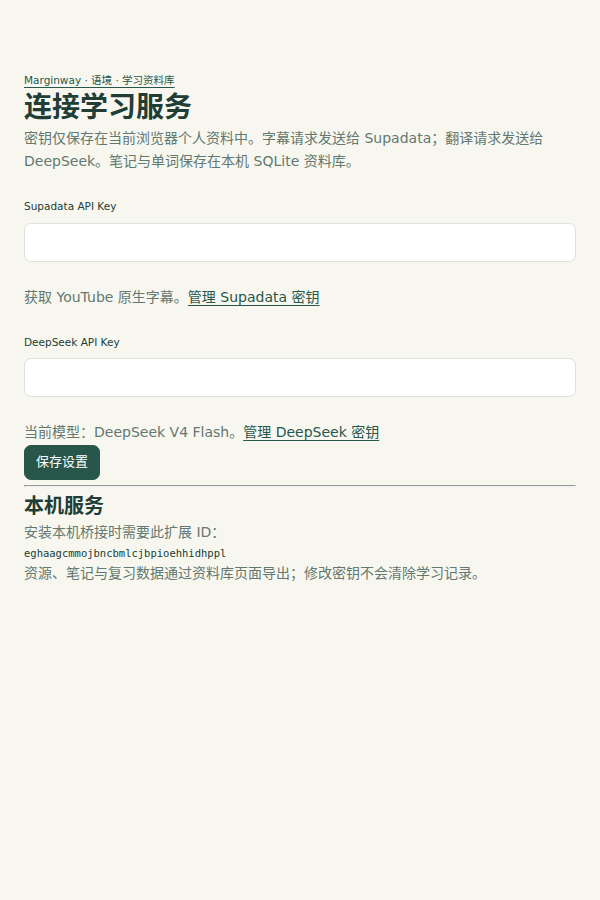

# 服务配置

完成[安装](installation.md)后，跟着 Agent 提示打开扩展的「设置」。API Key 是服务平台的访问凭证，不是登录密码；只在本机扩展设置里填写，不发给 Agent、不放进聊天或命令。

## 连接两项服务

| 服务 | 用途 | 获取密钥 |
| --- | --- | --- |
| Supadata | 获取 YouTube 原生字幕 | [Supadata 控制台](https://dash.supadata.ai/) |
| DeepSeek | 字幕翻译与划词释义 | [DeepSeek API Keys](https://platform.deepseek.com/api_keys) |

1. 登录各服务平台，按页面指引创建自己的 API Key，并确认可用额度。
2. 在扩展设置中分别填入对应字段，点击「保存设置」。
3. 按 Agent 提示返回页面验证；已打开的旧页面可刷新后再打开侧栏。

截图来自隔离测试，密钥为空；本机服务下的扩展 ID 以你自己 Chrome 中显示的为准。

## 费用与支持范围

两项服务分别计费，额度、余额、速率限制以各自平台为准，不承诺固定免费用量。首次读取未缓存视频可能产生字幕获取与全文翻译请求。当前仅获取原生字幕，不转写没有原生字幕的视频；相同任务尽量复用已有缓存，不等于所有请求都免费。

无需重新配置即可阅读本机已保存的笔记和词汇；新的字幕获取或翻译需要相应服务可用。首次验证可先用已有缓存，或明确选择一个有原生字幕的视频。

## 保存后仍不能使用

- 密钥无效或授权失败：确认没有填反、漏字符或多余空格，在对应平台检查密钥状态。
- 额度不足或限流：查看服务平台余额与限制，避免连续重试。
- 字幕获取超时或 HTTP 500：是获取失败，不代表没有字幕；稍后重试或复制诊断信息。只有服务明确返回无可用原生字幕时才检查视频字幕。
- 资料库无法连接：这是本机组件问题，按[安装排错](installation.md#升级与排错)检查；不要删除学习资料库。

配置存在不代表服务余额充足。`learning doctor` 不读取或验证密钥，也不会发送付费请求；Agent 应明确区分“已填写”和“请求已成功”。密钥存储与数据流见[隐私说明](../PRIVACY.md)。
