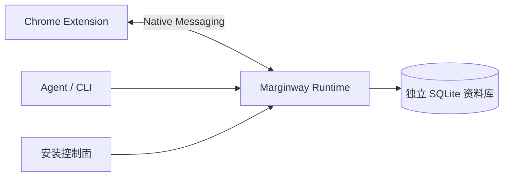

# Agent 协助安装：目标架构与契约

状态：设计定稿，尚未实现。对应 #16；当前可执行步骤以 [安装说明](installation.md) 为准。本文是未来安装控制面的唯一契约，不修改学习命令 API，也不宣称已有商店上架或原生分发。

## 选择与职责

目标收敛为一个 self-contained Marginway Runtime，用户不安装 Node/pnpm、不处理 PATH。优先采用打包的 Node 可执行文件与已 bundle 的 TypeScript，保留内置 SQLite；作为一个安装单元发布，而不强求单一物理文件。POSIX 用稳定启动器，Windows 用原生可执行入口（先验证 Node SEA 的 CJS bundle + node:sqlite，失败则交付经验证的启动器）；未通过真实 Chrome 协议验证前不承诺支持该平台。避免现在为安装器更换应用开发语言或数据库。

- Extension：网页/视频 UI、外部服务调用、密钥配置、连接诊断。密钥不交给 Runtime。
- Runtime：学习 CLI、本机桥接、安装控制命令，拥有可验证版本和稳定绝对入口。
- Native Messaging：Chrome 按固定 host 名启动 runtime 的 host 模式，校验精确 extension origin；协议 stdout 只能输出长度前缀 JSON。
- SQLite：独立用户数据生命周期；修复/重装不删除、重建或迁移到新空库。
- Agent：读取结构化证据，执行已列出的修复动作，将 Chrome 必须由用户操作的步骤明确交接。



## 用户与 Agent 两条流程

目标正式版：用户从 Chrome Web Store 安装扩展 → 首次连接页下载匹配平台 Runtime 或复制「交给 Agent 安装」 → Agent 安装/验证 → 用户只在扩展中填密钥 → 显示可开始学习。商店 ID 发布后固化于签名发布元数据；不解析 Chrome profile 文件猜 ID。商店上架和平台签名是正式分发前提，当前仍保留开发者模式目录选择流程。

Agent：获取带签名/校验和的指定平台包 → 用绝对路径运行 `setup --json` → `doctor --json` → 根据 actions 修复或交接 → 再运行 doctor。目录由用户选择或显式接受建议；命令输出绝对路径，后续调用不依赖新 shell 或 PATH。开发模式必须提供真实 `--extension-id`、`--extension-dir`，不把推荐目录当用户选择。正式版用已验证的发布 ID；额外 ID 必须显式配置，不能放宽为 wildcard。

断点：浏览器的安装/开发者模式目录选择、商店权限提示、密钥输入；Agent 没有得到所需输入时输出 WAITING_USER，而不伪报 READY。验证配置仅传布尔值，不能让 Agent 把密钥写入 prompt 或终端命令。

## 状态是证据的归纳

每次检测重新计算，持久化 journal 只记录操作，不作为真实性依据。下列是优先级摘要，不是不可逆阶段；组件独立检查，修好一个问题后可能暴露下一个问题。

| state | 必须具备的证据 |
|---|---|
| UNINSTALLED | 没有本项目拥有的 runtime 安装清单 |
| RUNTIME_INSTALLED | 包完整性、平台/架构、可执行入口自检通过 |
| NATIVE_HOST_REGISTERED | manifest、权限及 Windows 注册表指向一致，origin 精确匹配 |
| EXTENSION_DETECTED | 安装 ID 符合期望；只有一次真实 host 握手才可确认为 detected，不能靠目录存在推断 |
| CONNECTED | 本次 doctor 的随机 challenge 经 Extension ↔ Native Host 完整往返，版本/协议匹配，响应在超时内 |
| CONFIGURED | 同一连接返回所需 provider 配置存在的布尔结果；不等于余额充足或服务一定可用 |
| READY | 上述条件同时满足，数据路径一致且 SQLite 可读写自检通过，当前版本兼容 |

另有 NEEDS_REPAIR、WAITING_USER、UNSUPPORTED；失联不能沿用旧 READY。status 是只读快照，带 checkedAt、lastConnectedAt 和证据过期时间；doctor 的 connect probe 在控制目录写挑战，由活跃 host 转发给扩展，不写学习记录、不发翻译/字幕请求。原有 `learning status` 只反映 SQLite/bridge，不等同此安装状态。

## 最小 CLI contract（未来命令）

入口：`marginway <operation> --json`，始终支持返回的 executablePath。学习操作通过 `marginway learning <command>`，保留 `learning` 兼容入口，避免与现有学习 status 冲突。

| operation | 行为和边界 |
|---|---|
| setup | detect → plan → reconcile → verify；支持 --dry-run，开发模式要求 ID/目录，默认每用户安装 |
| status | 不产生写入，安装缺失也返回结构化快照，不隐式创建数据库 |
| doctor | 检查文件/签名/版本、注册、握手、配置与数据库；可 --probe-connect，未提供则连接为 unknown |
| repair | 仅执行 doctor 返回的 action ID；要求对应 planHash，状态变化则重新规划；不自动升级主版本 |
| update | 指定 --version；验证包后与 setup 共用 reconcile；禁止降级不兼容 schema |
| uninstall | 只移除本项目拥有的 runtime/注册/入口；默认且本阶段始终保留数据与备份，报告保留路径；不替用户卸载 Chrome 扩展 |

JSON envelope（schemaVersion=1）必须输出到 stdout，进度到 stderr；host 模式不使用这个 envelope。异常同样返回 JSON，不能要求 Agent 解析人类日志。

```json
{"schemaVersion":1,"ok":true,"operation":"doctor","state":"WAITING_USER","ready":false,"checks":[{"id":"extension.connection","status":"unknown","code":"OPEN_EXTENSION"}],"actions":[{"id":"open-extension","actor":"user","reason":"等待本次握手"}],"paths":{"executablePath":"/absolute/marginway","dataDir":"/absolute/data"},"planHash":"sha256:...","checkedAt":"2026-09-20T00:00:00Z"}
```

checks.status 为 pass/fail/unknown/skipped；包含 observed/expected（不得有密钥或笔记）。actions 包含结构化 argv、前置条件、影响、requiresUser；永远不返回需要 shell eval 的拼接命令。ok 表示命令成功运行，不表示安装就绪，必须检查 ready。退出码：0 检测/动作成功（含 WAITING_USER）；2 参数无效；3 操作失败；4 不支持的平台/版本；5 状态竞争需重跑；JSON error 带稳定 code 和 retryable。Agent 仅对 retryable 做有限重试，三次相同故障终止并给出证据。

## 原子更新、回退与所有权

setup/update/repair 持有每用户安装锁；验证包的签名、SHA-256、版本和无路径穿越后解压到新版本目录。先自检再写配置与 manifest，最后切换稳定启动入口；以同目录临时文件替换，Windows 对占用文件延迟切换而非强杀用户 Chrome。记录 journal，下一次运行按文件事实恢复；失败切回完整旧版本。禁止边删旧目录边复制新包。

安装清单保存 owned paths、expected origins、数据路径、版本/hash、最近成功注册内容。repair 只修本项目文件，遇未知内容报告 OWNERSHIP_CONFLICT；uninstall 不清理任意同名目录，也不删除其他扩展的注册。先对比当前注册内容与清单再移除；同一操作可重复运行，operationId 绑定参数指纹，输入变化需新操作。磁盘不足、权限不足、代理下载失败都可重新检测后续跑。

Runtime 版本目录与 SQLite dataDir 分开：沿用现有 `~/.local/share/learning-companion` 数据，发现 LC_DATA_DIR/旧清单不一致时明确选择，不能静默新建空库。配置在 control 目录，包在 runtime/versions，数据和备份不落入包目录。schema 升级先备份并验证，再在事务内迁移；升级回退必须检查 schema 兼容，不自动拿旧快照覆盖升级后的新学习记录。实现首期 schema 不变。

## 平台适配

| 平台 | 分发目标 | 每用户注册位置 |
|---|---|---|
| macOS arm64/x64 | 签名、公证 Runtime 包，稳定启动器引用内部 Node 绝对路径 | `~/Library/Application Support/Google/Chrome/NativeMessagingHosts/com.learning_companion.host.json` |
| Windows x64（arm64 单独验证） | 签名 Runtime 包/安装器，原生 exe 入口，正确传递 argv 与 stdio | HKCU `Software\Google\Chrome\NativeMessagingHosts\com.learning_companion.host` 默认值为 manifest 绝对路径 |
| Linux x64/arm64 | 校验签名的 archive，规定最低 glibc；每用户 POSIX 启动器 | `~/.config/google-chrome/NativeMessagingHosts/com.learning_companion.host.json` |

安装路径可配置，JSON 输出实际路径，不依赖 PATH；规范化包含空格/Unicode 的路径，禁止临时介质作为长期 host 路径。不请求管理员权限。只支持原生桌面 Chrome；Chromium、Chrome for Testing、自定义 user-data-dir、Snap/Flatpak 先返回不支持或显式选择已验证适配，不猜注册路径。多个 Chrome profile 共用每用户 runtime，连接检查标明 extensionId/会话，API Key 仍各 profile 独立。

## 扩展中的故障表达

侧栏和设置共享连接状态卡：未安装 →「安装本机组件」；注册/版本异常 →「修复连接」；配置缺失 →「填写服务密钥」；握手通过 →「可以开始学习」。提供「复制给 Agent」：产品/协议版本、非敏感错误码、期望扩展 ID、用户已选路径、官方安装说明链接与需运行的 doctor 命令。状态未知写“尚未验证”，不使用模糊“已连接”。不复制密钥、整库数据、用户目录清单或自行探测的其他应用信息。

## 交付验证与门槛

| 场景 | 可重复验证 / 成功条件 |
|---|---|
| 全新机器无 Node/pnpm | 每平台隔离 VM 下载真实包，除 Chrome 操作/密钥外 Agent 完成；真实 nonce 往返后 READY |
| 重复 setup / 中途退出 | 同 operationId 不重复写入；每个阶段终止后再执行可收敛，旧版本仍可启动 |
| manifest/注册损坏 | doctor 精确报告 path/origin mismatch；repair 修改自有内容，陌生注册拒绝覆盖；再次 doctor 通过 |
| 旧 runtime/协议 | 返回 VERSION_INCOMPATIBLE；更新后 Extension/CLI/host 同版本，拒绝不兼容降级 |
| 数据保留 | seed 资源/笔记/词条/修订历史；repair/reinstall/update/uninstall 前后数据和时间戳一致；重装后仍读原库 |
| 浏览器关闭/错 profile/无密钥 | 分别 WAITING_USER 或 unknown，不发外部请求、不伪报 READY；用户完成后复检通过 |
| 权限/磁盘/下载/签名/锁失败 | 明确错误码；不破坏旧包/注册，签名失败不执行，锁竞争返回5 |
| Windows 特例 | 真正写入隔离用户注册表，真实 Chrome 启动 host；不能用 skip-registration 代替验收 |

实施顺序：先验证无系统 Node 的启动器/SQLite/Native Messaging 三平台 spike；再实现 JSON detector 与安装所有权/journal；再做升级修复与扩展状态卡；最后取得正式商店 ID、签名产物并发布。每一步独立 PR/Issue，方案通过不代表免 Node 安装器已交付。

依据：[Chrome Native Messaging](https://developer.chrome.com/docs/extensions/develop/concepts/native-messaging)、[Node SEA](https://nodejs.org/api/single-executable-applications.html)；现有实现证据为 scripts/install.ts、scripts/smoke-release.ts 与 apps/native-host/src/index.ts。现有 CI 证明可重装及数据独立，尚未证明无需 Node、可恢复原子升级或真实三平台 Chrome 注册。
